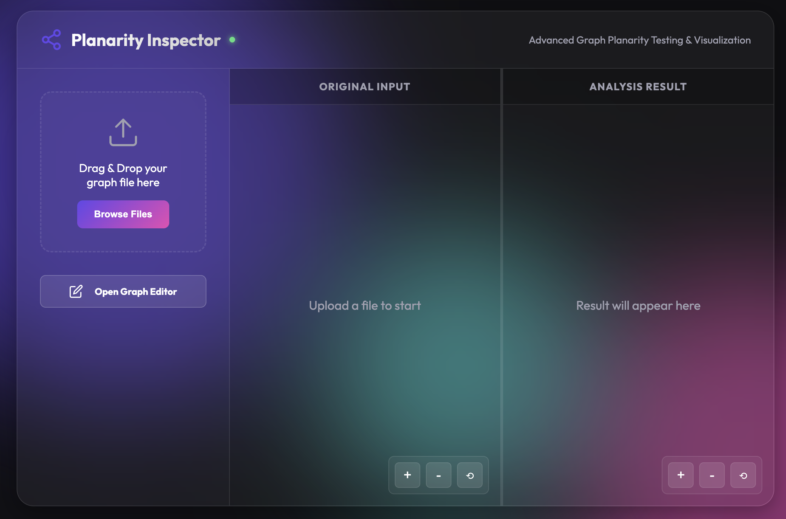
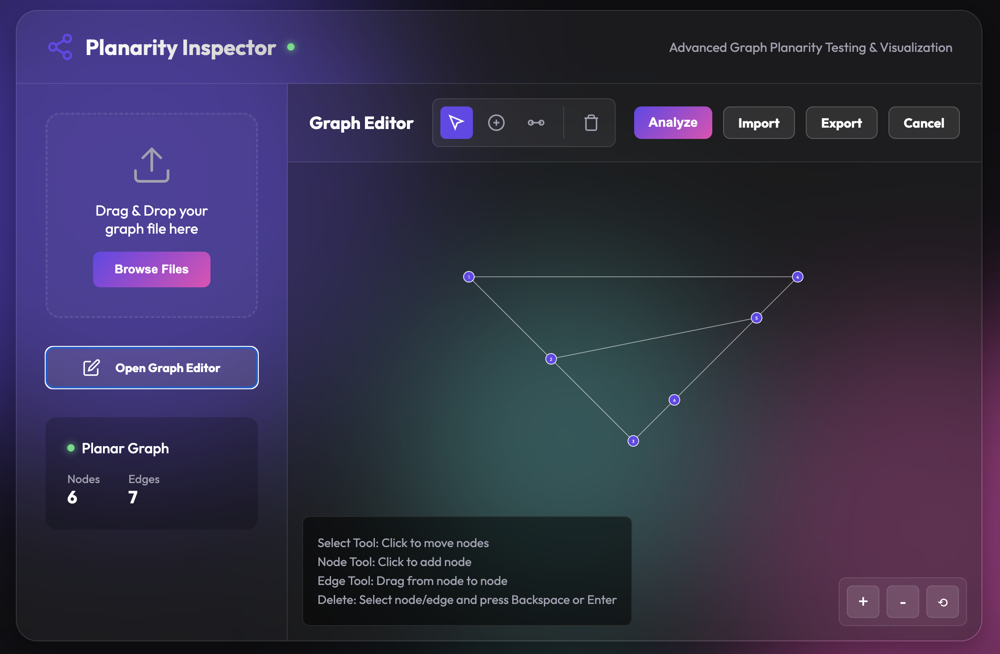
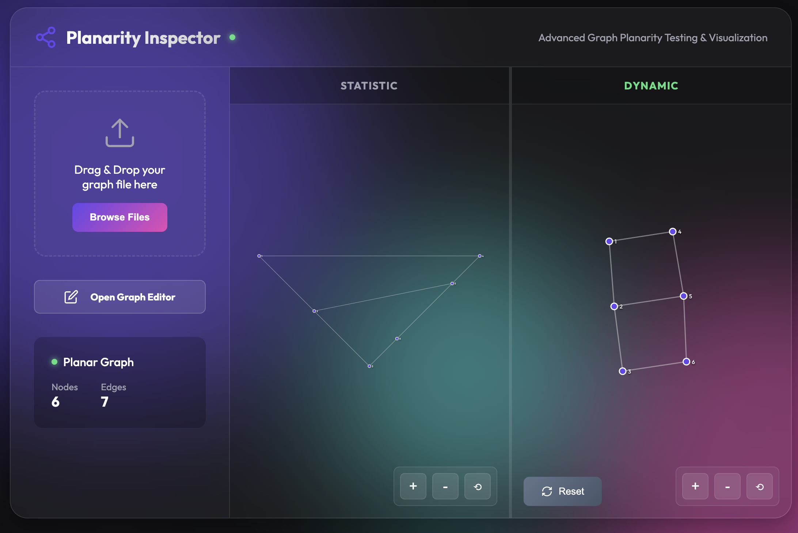
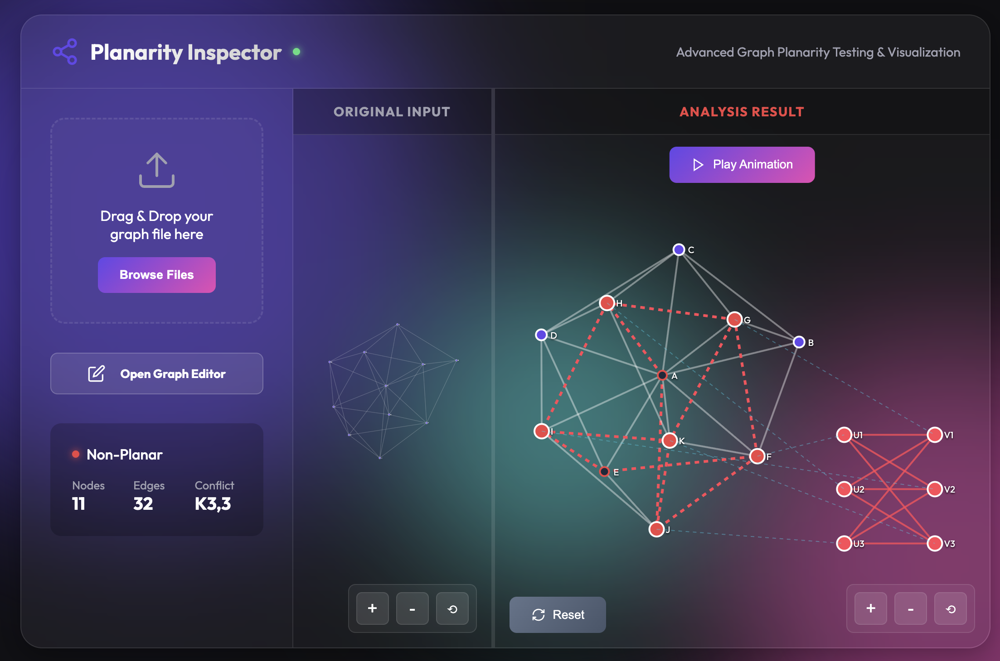

# 🌐 Planarity Testing Tool

A powerful web-based application for testing graph planarity with advanced visualization and interactive graph editing capabilities.


## ✨ Features

### 🎨 Interactive Graph Editor
- **Visual Graph Creation**: Draw graphs directly in the browser with an intuitive interface
- **Node Management**: Click to add nodes, drag to reposition
- **Edge Creation**: Drag between nodes to create connections
- **Selection & Deletion**: Select elements and delete with keyboard shortcuts (Backspace/Delete/Enter)
- **Zoom & Pan**: Navigate large graphs with mouse wheel zoom and drag-to-pan
- **Import/Export**: 
  - Import graphs from multiple formats (.txt, .json, .gml, .graphml, .gexf, .dot, .mtx, .net)
  - Export graphs as space-separated edge lists

### 📊 Advanced Visualization

#### Planar Graphs
- **Force-Directed Layout**: Automatic positioning using physics simulation
- **Static Mode**: Disable physics for manual layout control
- **Interactive Manipulation**: Drag nodes to adjust positions
- **Enable/Disable Physics**: Toggle between static and dynamic layouts

#### Non-Planar Graphs
- **Automatic Conflict Detection**: Identifies K₅ or K₃,₃ subdivisions
- **Canonical Visualization**: Displays the canonical K₅ or K₃,₃ structure
- **Conflict Highlighting**: Visual emphasis on edges forming the subdivision
- **Snap-to-Canonical**: Drag conflict nodes to snap them to canonical positions

### 🎬 Step-by-Step Animation
- **Progressive Visualization**: Walk through conflict edges one by one
- **Fly-Out Effect**: Watch edges animate from your graph to the canonical structure
- **Animation Controls**: Previous/Next buttons with progress tracking
- **Visual Feedback**: Clear indication of the graph-to-canonical mapping

### 📁 Multi-Format Support

The tool supports a wide range of graph file formats:

| Format | Extension | Description |
|--------|-----------|-------------|
| Edge List | `.txt` | Space or comma-separated node pairs |
| Adjacency Matrix | `.txt` | Square matrix representation |
| JSON | `.json` | Node-link format with nodes and edges/links arrays |
| GML | `.gml` | Graph Modeling Language |
| GraphML | `.graphml` | XML-based graph format |
| GEXF | `.gexf` | Graph Exchange XML Format |
| DOT | `.dot`, `.gv` | Graphviz format |
| Matrix Market | `.mtx` | Sparse matrix format |
| Pajek | `.net` | Pajek network format |

### 🎯 Smart File Parsing

The backend uses intelligent content sniffing:
1. **Content-Based Detection**: Identifies format by file content (JSON, XML, etc.)
2. **Extension Fallback**: Uses file extension when content detection fails
3. **Robust Edge List Parser**: Handles both matrix and edge list formats in `.txt` files
4. **Automatic Conversion**: Converts directed graphs to undirected automatically

## 🚀 Getting Started

### Prerequisites

- **Python**: 3.8 or higher
- **Node.js**: 16 or higher (optional, for serving frontend)
- **Modern Browser**: Chrome, Firefox, Safari, or Edge

### Installation

1. **Clone the repository**
   ```bash
   git clone https://github.com/MamboJiang/Planarity-Testing.git
   cd Planarity-Testing
   ```

2. **Backend Setup**
   ```bash
   cd Backend
   pip install -r requirements.txt
   ```

3. **Start the Backend**
   ```bash
   python app.py
   ```
   The backend will start on `http://localhost:5001`

4. **Frontend Setup**
   
   The frontend is a static site. You can:
   
   **Option A**: Open directly in browser
   ```bash
   cd Frontend
   open index.html  # macOS
   # or simply double-click index.html
   ```
   
   **Option B**: Use a local server (recommended)
   ```bash
   cd Frontend
   npx serve .
   # or
   python -m http.server 8000
   ```

## 📖 Usage Guide

### 1. Upload a Graph

**Method 1: Drag & Drop**
- Drag any supported graph file onto the drop zone
- The file will be automatically processed

**Method 2: File Browser**
- Click the "Drag & Drop" area
- Select a file from your computer

### 2. Create a Graph Manually

1. Click **"Open Graph Editor"**
2. Use the toolbar:
   - **Select Tool** (🖱️): Move nodes and select elements
   - **Node Tool** (⚫): Click to add nodes
   - **Edge Tool** (➖): Drag between nodes to create edges
   - **Clear/Delete** (🗑️): Clear all or delete selected element
3. Click **"Analyze"** to check planarity
4. Or click **"Export"** to save your graph

### 3. View Results

#### Planar Graph
- View the planar embedding in the "Dynamic" panel
- Click **"Enable Physics"** to interact with the layout
- Drag nodes to adjust positions
- Click **"Reset"** to restore original positions

#### Non-Planar Graph
- The result panel expands automatically
- View the conflict type (K₅ or K₃,₃)
- See the canonical structure on the right
- Drag conflict nodes to snap them to canonical positions
- Click **"Play Animation"** to see the step-by-step visualization

### 4. Animation Controls

When viewing a non-planar graph:
1. Click **"Play Animation"**
2. Use **Previous/Next** buttons to step through
3. Watch edges fly from your graph to the canonical form
4. Click **"Cancel Animation"** to return to static view

## 📸 Screenshots

| | |
|:--:|:--:|
|  |  |
|  |  |

## 🏗️ Architecture

### Backend (`/Backend`)

**Technology Stack:**
- Flask (Web Framework)
- NetworkX (Graph Algorithms)
- Flask-CORS (Cross-Origin Support)

**Key Components:**
- `app.py`: Main Flask application
- `parse_graph_file()`: Multi-format file parser
- `check_planarity()`: Planarity testing endpoint

**API Endpoint:**
```
POST /check-planarity
Content-Type: multipart/form-data
Body: file (graph file)

Response:
{
  "status": "planar" | "non_planar",
  "type": "None" | "K5" | "K3,3",
  "nodes": [{"id": "1", "x": 100, "y": 200}, ...],
  "edges": [{"source": "1", "target": "2", "is_conflict": false}, ...],
  "message": "Graph is Planar"
}
```

### Frontend (`/Frontend`)

**Technology Stack:**
- Vanilla JavaScript (ES6+)
- D3.js v7 (Visualization)
- HTML5 & CSS3

**Key Components:**
- `index.html`: Main application structure
- `style.css`: Glassmorphism design system
- `js/main.js`: Application entry point
- `js/editor.js`: Graph editor implementation
- `js/visualization.js`: D3.js rendering logic
- `js/api.js`: Backend communication
- `js/ui.js`: UI state management

## 🎨 Design Philosophy

The application features a modern **glassmorphism** design with:
- Semi-transparent panels with backdrop blur
- Smooth animations and transitions
- Vibrant gradient backgrounds
- Responsive layout
- Dark theme optimized for extended use

## 🧪 Example Files

The `test_files/` directory contains various example graphs:
- `planar_*.txt`: Planar graph examples
- `k5.txt`, `k33.txt`: Classic non-planar graphs
- `peterson.txt`: Petersen graph
- Various format examples (.json, .gml, etc.)

## 🔧 Development

### Project Structure
```
Planarity-Testing/
├── Backend/
│   ├── app.py                 # Flask application
│   └── requirements.txt       # Python dependencies
├── Frontend/
│   ├── index.html            # Main HTML
│   ├── style.css             # Styles
│   └── js/
│       ├── main.js           # Entry point
│       ├── editor.js         # Graph editor
│       ├── visualization.js  # D3.js rendering
│       ├── api.js            # API calls
│       └── ui.js             # UI management
└── test_files/               # Example graphs
```

### Adding New Features

**Backend:**
1. Add new format support in `parse_graph_file()`
2. Extend the API response in `check_planarity()`

**Frontend:**
1. Update UI in `index.html` and `style.css`
2. Add logic in appropriate JS module
3. Update `main.js` for event handling

## 🤝 Contributing

Contributions are welcome! Please feel free to submit a Pull Request.

## 📄 License

This project is licensed under the MIT License.

## 🙏 Acknowledgments

- **NetworkX**: Graph algorithms and data structures
- **D3.js**: Powerful visualization library
- **Flask**: Lightweight web framework

## 📧 Contact

For questions or feedback, please open an issue on GitHub.

---

**Made with ❤️ for graph theory enthusiasts**
